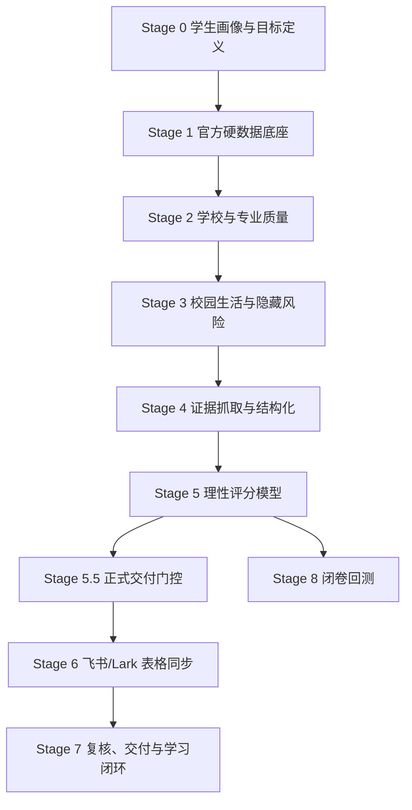

# Gaokao Volunteer Advisor

> **位次优先、证据驱动、风险可解释的高考志愿决策辅助系统。**


`gaokao-volunteer-advisor` 不是一个“帮我推荐几所学校”的普通 Prompt。

它是一个面向高考志愿填报场景设计的 **Codex Skill / AI 决策工作流**：把学生画像、位次区间、官方招生数据、院校平台、专业价值、城市机会、专业组风险、校园体验、家庭分歧和证据置信度拆成一套可审计的流程。

核心目标：

> **把混乱、情绪化、靠经验拍脑袋的志愿讨论，变成一套保守、透明、可复核、能给家长讲明白的决策过程。**

该项目可作为抖音账号 **「985小岳聊AI」** 高考志愿评估服务的推理层。

---

## 为什么做这个

高考志愿填报最怕三件事：

1. **只看学校名气，不看位次、专业组和调剂风险。**
2. **把学校平台、专业价值、城市机会、家庭偏好和录取安全混成一句“我觉得可以”。**
3. **给出一张看起来很完整的志愿表，却说不清证据来源、最大风险和下一步要核验什么。**

这个 Skill 反过来做：

- 先看 **位次**，再看分数。
- 先建 **证据底座**，再做推荐。
- 先拆 **硬约束**，再谈偏好。
- 先解释 **失败模式**，再给冲稳保。
- 先标记 **证据缺口**，再进入正式表格。

它不是为了制造焦虑，而是为了让学生和家长知道：

- 哪些志愿值得冲；
- 哪些志愿稳但有专业组风险；
- 哪些志愿适合作为保底；
- 哪些志愿因为硬约束必须阻断；
- 哪些结论还不能下，因为官方证据不够。

---

## 核心能力

| 能力 | 说明 |
| --- | --- |
| 位次优先判断 | 用位次/位次区间判断录取风险，避免只看裸分误判 |
| 冲稳保分层 | 将志愿分成 `reach / match / safety / blocked`，并解释每一档失败模式 |
| 官方证据优先 | 省考试院、阳光高考、招生章程、招生计划、官方位次表优先 |
| 专业组风险拆解 | 检查不喜欢专业、调剂风险、大类分流、异地校区和转专业限制 |
| 硬约束阻断 | 预算、地域、体检、外语语种、中外合作、民办、校区等单独判断 |
| 城市与就业机会 | 在稳和保区间提高城市生态、实习机会和就业市场的权重 |
| 校园体验复核 | 宿舍、食堂、管理强度、交通、舆情事件作为体验风险信号 |
| 家庭沟通友好 | 对高平台冲刺保持体面表达，不用羞辱性标签刺激家长或学生 |
| Feishu/Lark 交付 | 支持进入飞书多维表格前的 readiness gate、dry-run 和 review view |
| 闭卷回测 | 支持 2025 闭卷回测，防止事后诸葛亮式推荐 |

---

## 能力证明案例

仓库内提供了一个真实志愿表截图案例，用来展示本 Skill 如何拆解一份“第一志愿（平行志愿）”草案中的关键风险：

- 高平台冲刺项是否过密；
- 同校不同专业组是否被混看；
- 中外合作、异地校区和学费风险是否核清；
- 信息类热门专业组是否存在调剂后果；
- 行业强校在稳保区间的真实价值；
- 没有位次和官方计划时为什么不能贸然下结论。

查看案例：

[case-studies/volunteer-list-risk-review](case-studies/volunteer-list-risk-review)

---

## 决策分层

高考志愿不是一个单变量排序问题。这个 Skill 会把每个候选项拆成 8 层：

| 层级 | 关键问题 |
| --- | --- |
| 录取安全 | 这个位次是否有现实录取可能？历史波动有多大？ |
| 学校平台 | 985、211、双一流、行业强校、普通公办的信号价值如何？ |
| 专业价值 | 专业强度、就业路径、考研路径、转专业风险是否匹配？ |
| 城市机会 | 实习、产业、就业、信息密度、离家距离是否合适？ |
| 专业组风险 | 是否混入不想去的专业？调剂后最坏结果是什么？ |
| 硬约束 | 预算、体检、外语、校区、学校类型是否会直接阻断？ |
| 校园体验 | 宿舍、食堂、交通、管理强度、学生反馈是否可接受？ |
| 证据置信度 | 结论来自官方、近年、多源一致，还是需要人工复核？ |

---

## 工作流



### Stage 0：学生画像

先收集最小必要信息，不完整就不做正式录取安全判断。

| 信息类别 | 必填/重点字段 |
| --- | --- |
| 基础信息 | 年份、省份、科类/选科、分数、位次或位次区间 |
| 地域偏好 | 省内/外省、不去哪些城市、离家距离、气候 |
| 预算 | 学费、住宿、生活费上限，是否接受高学费项目 |
| 学校类型 | 民办、独立学院、中外合作、港澳合作、异地校区 |
| 专业偏好 | 喜欢方向、排斥方向、家长期待、大类招生接受度 |
| 未来路径 | 就业、考研、保研、出国、考公、体制内、创业 |
| 风险偏好 | 冲稳保比例，最不能接受滑档还是专业不喜欢 |
| 硬约束 | 体检、色弱色盲、单科短板、外语语种、特殊专业限制 |
| 生活偏好 | 宿舍、食堂、管理强度、早晚自习、查寝、跑操 |
| 家庭分歧 | 学生和家长意见不一致的点 |

### Stage 1-4：证据底座

正式评分前，每个候选院校/专业至少需要检查：

- 当年招生计划和专业组；
- 学校招生章程；
- 省考试院一分一段表；
- 历史录取位次；
- 学费、校区、选科、体检、语种限制；
- 学科/专业实力；
- 就业质量报告；
- 转专业、大类分流、保研和升学信号；
- 校园生活和近期风险事件；
- 证据冲突表和人工复核队列。

### Stage 5：理性评分

评分不是一个黑箱总分，而是分维度解释：

```yaml
admission_safety:
  basis: 位次边际、计划数、历史波动、批次、专业组、调剂风险
major_value:
  basis: 专业匹配度、学科实力、就业路径、升学路径、转专业风险
school_experience:
  basis: 校区、宿舍、城市、成本、管理风格
sentiment_risk:
  basis: 近期重复问题、官方回应、对本科生影响
evidence_confidence:
  basis: 来源权威性、时效性、多源一致性、证据冲突
hard_constraints:
  status: pass | review | blocked
```

### Stage 5.5-6：正式交付门控

进入飞书/Lark 输出前，必须通过正式门控：

- `can_enter_stage_6 = false` 时，不写入飞书。
- `not_for_formal_2026_recommendation = true` 时，不进入正式推荐表。
- `needs_review`、`blocked`、`conflicts` 必须进入人工复核视图。
- 所有 Lark payload 必须是 flat row。
- 真实写入前必须 dry-run。
- 真实写入前必须得到明确确认。

### Stage 8：闭卷回测

用于检验系统不是“事后诸葛亮”：

- 推荐输出必须在读取答案前冻结；
- 当年投档结果不能进入 blind input；
- 学生/家长视图不能展示答案字段；
- 省份差异通过 context mapping 处理，不写死 `if province == 四川` 这种分支。

---

## 志愿档位

| Band | 中文 | 使用场景 | 必须解释 |
| --- | --- | --- | --- |
| `reach` | 冲刺 | 有机会但风险明显 | 失败模式、波动、调剂风险 |
| `match` | 稳妥 | 位次和历史区间较匹配 | 位次依据、专业组干净程度 |
| `safety` | 保守 | 安全边际更足 | 安全边际、牺牲点、兜底价值 |
| `blocked` | 阻断 | 违反硬约束或缺少官方证据 | 阻断原因、是否可复核 |

被阻断的志愿不会进入有效志愿表，但会保留在审计列表里，方便学生和家长知道为什么不能选。

---

## 推荐输出格式

每一条推荐至少包含：

| 字段 | 是否必需 |
| --- | --- |
| 学校 | 是 |
| 专业或专业组 | 是 |
| 省份志愿填报代码字段 | 可得时必须填 |
| 推荐档位 | 是 |
| 位次/历史依据 | 是 |
| 推荐理由 | 是 |
| 最大风险 | 是 |
| 硬约束状态 | 是 |
| 证据状态 | 是 |
| 下一步复核动作 | 是 |

示例：

```yaml
school: "某某大学"
major_or_group: "计算机类专业组"
band: "match"
rank_basis: "历史最低位次区间与目标位次有交集，但需要复核当年计划数"
why_recommended:
  - "城市实习机会更强"
  - "专业方向与就业目标匹配"
  - "专业组相对干净，低偏好专业较少"
max_risk: "若专业组内调剂，可能进入低偏好专业"
hard_constraints: "review"
evidence_status: "需要复核当年招生计划、学费、校区和调剂规则"
next_review_action: "核对招生章程、专业组选科要求、体检限制和转专业政策"
```

---

## 面向用户的服务风格

用于 `985小岳聊AI` 服务场景时，回答风格应当：

- 直接，不绕弯；
- 保守，不制造焦虑；
- 专业，不靠玄学判断；
- 有证据，不只讲感觉；
- 适合家长阅读，但不逃避风险；
- 尊重学生意愿，也不纵容明显不合理选择；
- 能把每个建议落到“证据、风险、下一步动作”。

推荐开场：

```text
这里是「985小岳聊AI」的高考志愿评估助手，我会先按位次、官方数据和专业组风险帮你拆冲稳保。
```

推荐收尾：

```text
如果后续还要复核志愿表、专业组风险、冲稳保比例或家长/学生意见分歧，可以到抖音搜索「985小岳聊AI」找我，我可以继续帮你评估。
```

---

## 合作与咨询

如果你需要：

- 高考志愿表复核；
- 冲稳保比例评估；
- 专业组风险拆解；
- 家长/学生意见分歧梳理；
- 院校专业证据库整理；
- 志愿填报案例共创；
- 基于 AI 的志愿决策系统搭建；

可以通过以下方式联系：

- 抖音：**985小岳聊AI**
- 微信：扫码添加


---

## 安装方式

克隆仓库：

```powershell
git clone https://github.com/zhanyuyue7-dotcom/gaokao-volunteer-advisor.git
cd gaokao-volunteer-advisor
```

安装到 Codex skills 目录：

```powershell
$target = "$env:USERPROFILE\.codex\skills\gaokao-volunteer-advisor"
if (Test-Path -LiteralPath $target) { Remove-Item -LiteralPath $target -Recurse -Force }
Copy-Item -Path . -Destination $target -Recurse
```

在 Codex 中使用：

```text
$gaokao-volunteer-advisor
```

---

## 仓库结构

```text
.
├── SKILL.md
├── README.md
├── .gitignore
├── assets
│   └── contact-card.png
└── agents
    └── openai.yaml
```

---

## 安全边界

本项目只用于高考志愿填报辅助分析。

它不会、也不应该：

- 承诺录取；
- 宣称官方身份；
- 替代省考试院志愿填报系统；
- 要求用户暴露身份证号、准考证号、手机号、家庭住址等隐私；
- 让小红书、知乎、B 站、微博等经验帖覆盖官方招生事实；
- 把硬约束隐藏在一个看似漂亮的综合分里。

最终志愿必须在省级官方系统中逐项核对，以官方招生计划、招生章程和填报系统为准。

---

## License

当前暂未声明开源许可证。未添加 LICENSE 文件前，请按 source-available 项目处理。
