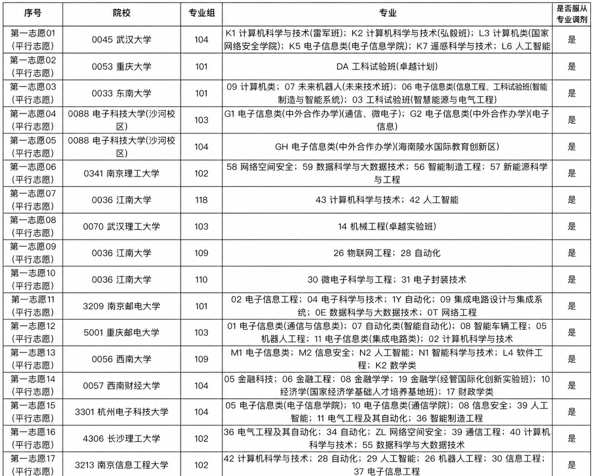

# 案例：第一志愿表风险复核

> 这个案例用于展示 `gaokao-volunteer-advisor` 的核心能力：不是简单判断“学校好不好”，而是把一张志愿表拆成 **位次风险、专业组风险、平台梯度、调剂后果、证据缺口和下一步复核动作**。



## 原始表格附件

本案例同时保留飞书表格导出的 xlsx 文件，便于后续做真实数据读取、结构化分析和闭卷回测样例构建：

[feishu-volunteer-list.xlsx](feishu-volunteer-list.xlsx)

文件来源：飞书表格导出  
工作表结构：

- `冲稳保主表`
- `下架清单`

---

## 案例背景

截图是一份“第一志愿（平行志愿）”草案，包含多所高校和专业组，例如：

- 武汉大学
- 重庆大学
- 东南大学
- 电子科技大学（沙河校区）
- 南京理工大学
- 江南大学
- 武汉理工大学
- 南京邮电大学
- 重庆邮电大学
- 西南大学
- 西南财经大学
- 杭州电子科技大学
- 长沙理工大学
- 南京信息工程大学

专业方向集中在：

- 计算机科学与技术
- 人工智能
- 电子信息类
- 网络空间安全
- 自动化
- 数据科学与大数据技术
- 机械工程 / 智能制造
- 金融科技 / 金融工程

截图中还显示多数条目选择了“服从专业调剂”。

---

## 这个案例能证明什么

这类志愿表表面上看是“学校 + 专业组”的排列，真正的风险不在表面。

`gaokao-volunteer-advisor` 会重点检查：

| 复核维度 | 要回答的问题 |
| --- | --- |
| 位次匹配 | 学生位次是否支撑该层级院校？冲刺项和稳妥项是否比例失衡？ |
| 平台梯度 | 985、强 211、行业强校、普通公办之间是否排序合理？ |
| 专业组干净程度 | 专业组里是否混入学生明显不想去的专业？ |
| 调剂后果 | 服从调剂后，最坏会被分到哪个专业？学生能否接受？ |
| 中外合作风险 | 高学费、培养地点、毕业证、转专业和保研规则是否核清？ |
| 异地校区风险 | 沙河校区、海南陵水等校区是否符合家庭预期？ |
| 城市机会 | 学校平台相近时，城市实习、就业、产业生态是否足够强？ |
| 专业价值 | 专业名称相似时，实际培养方向和就业路径是否不同？ |
| 证据置信度 | 结论是否来自官方招生章程、计划、历史位次和专业组信息？ |

---

## 初步结构化观察

在没有学生位次、选科、省份规则和当年招生计划前，本案例**不做正式录取安全判断**。但仅从表格结构看，已经能抽出几类需要复核的风险。

### 1. 高平台冲刺项集中

表格前部出现武汉大学、重庆大学、东南大学等高平台院校。

这些学校可以作为高上限冲刺项，但必须核对：

- 学生位次是否接近历史录取边界；
- 专业组内是否存在明显低偏好专业；
- 服从调剂后是否会进入学生无法接受的方向；
- 当年计划数是否缩减；
- 专业组代码是否与目标专业完全对应。

### 2. 同校不同专业组需要拆开看

例如电子科技大学（沙河校区）、江南大学等出现多个专业组。

这类情况不能只说“这个学校能不能上”，而要拆成：

- 每个专业组的历史录取位次；
- 每个专业组的专业构成；
- 每个专业组的调剂范围；
- 是否中外合作；
- 是否异地校区；
- 学费和培养模式；
- 是否影响保研、转专业、出国和就业路径。

### 3. 信息类专业集中，调剂风险更要看细

表格中大量集中在计算机、人工智能、电子信息、自动化、网安、数据科学等方向。

这说明学生目标比较清晰，但也带来两个风险：

- 热门专业组录取位次波动可能更大；
- 一旦服从调剂，可能进入与目标差异较大的专业。

因此不能只看“专业组里有计算机”，还要看这个组里所有专业是否都能接受。

### 4. 行业强校有就业价值，但不能和 985/211 平台混为一谈

南京邮电大学、重庆邮电大学、杭州电子科技大学、南京信息工程大学等属于典型行业强校或信息类就业友好型院校。

它们在稳妥和保守区间很有价值，但排序时要同时考虑：

- 城市就业生态；
- 目标专业强度；
- 专业组干净程度；
- 历史位次安全边际；
- 学校平台对考研、保研、就业简历筛选的影响。

### 5. 财经类志愿需要确认是否真实偏好

西南财经大学相关专业组出现在表格中，方向包括金融科技、金融工程、金融学等。

如果学生主线是电子信息/计算机/AI，这类志愿需要单独问清：

- 是真实兴趣，还是为了学校平台；
- 是否接受从工科技术路径转向金融/经管路径；
- 是否清楚课程结构和就业路径差异；
- 是否把“学校名气”误当成“专业匹配”。

---

## Skill 输出时会怎么处理

这个案例进入正式服务时，`gaokao-volunteer-advisor` 不会直接给“能上/不能上”的结论，而会按下面格式推进。

### Step 1：补齐 Stage 0 信息

必须先补：

- 省份
- 年份
- 科类/选科
- 分数
- 位次或位次区间
- 是否有官方一分一段表
- 预算上限
- 是否接受中外合作
- 是否接受异地校区
- 是否接受被调剂到非目标专业
- 家长和学生对学校平台/专业方向的优先级差异

### Step 2：分档复核

每个志愿不会只看学校名，而是拆成：

```yaml
school: "院校名称"
group: "专业组代码"
majors: "专业组内全部专业"
band: "reach | match | safety | blocked"
rank_basis: "历史位次和当前位次关系"
platform_value: "学校平台价值"
major_value: "专业匹配和就业/升学价值"
adjustment_risk: "服从调剂后的最坏结果"
hard_constraints: "pass | review | blocked"
evidence_status: "official | secondary | gap"
next_review_action: "下一步必须核查的官方材料"
```

### Step 3：输出家庭可读的风险表

最终不是只给一个排序，而是给：

- 冲刺项：说明失败模式；
- 稳妥项：说明专业组风险；
- 保守项：说明兜底价值和牺牲点；
- 阻断项：说明为什么不能放入有效志愿表；
- 复核队列：列出必须人工核查的官方材料。

---

## 这个案例的展示价值

这张图适合放在项目里作为能力证明，因为它天然覆盖了高考志愿评估中最容易出错的几类问题：

- 高平台冲刺与真实录取概率的分离；
- 同一学校不同专业组不能混看；
- 中外合作和异地校区需要单独核验；
- 热门信息类专业组不能只看名称；
- 服从调剂必须分析最坏结果；
- 行业强校在稳保区间的真实价值；
- 财经类/工科类路径混排时的偏好冲突；
- 没有位次和官方计划时不能装作有结论。

这正是 `gaokao-volunteer-advisor` 的定位：

> **不是替用户拍板，而是把志愿表里的每个风险拆开，让学生和家长知道自己到底在赌什么、保什么、牺牲什么。**

---

## 安全说明

本案例只展示一份志愿草案截图中的公开院校和专业组信息，不包含学生姓名、准考证号、身份证号、手机号、家庭住址等隐私字段。

本案例不构成正式志愿推荐。正式判断必须结合学生省份、年份、选科、分数、位次、预算、家庭偏好和官方招生数据。
